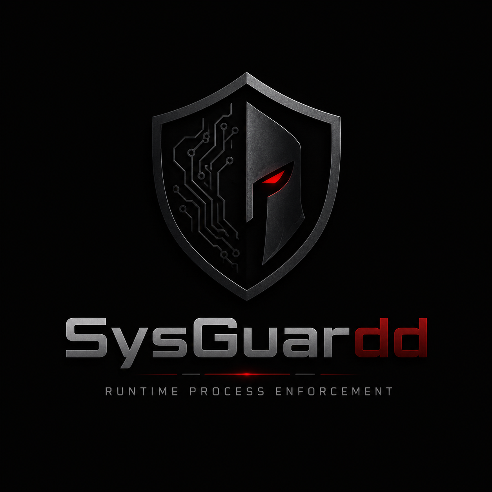

# SysGuardd

<div align="center">
  
</div>

SysGuardd is a runtime process enforcement daemon focused on stopping unauthorized execution on Linux hosts and Kubernetes nodes.

It combines kernel-level visibility (via eBPF), deterministic policy evaluation, and fast active mitigation to reduce time-to-detect and time-to-block.

## Why SysGuardd
- Detect execution attempts at the kernel boundary.
- Stream process telemetry with near-zero overhead.
- Apply strict policy decisions in real time.
- Terminate unauthorized processes in sub-millisecond paths.
- Export audit-ready telemetry for SIEM and platform integrations.

## Core Capabilities

### Kernel-Level Detection
- Intercepts process execution events such as `execve` with eBPF hooks.
- Captures high-value metadata before process compromise impact.

### Lockless Telemetry Streaming
- Uses memory-mapped lockless ring buffers for low-latency event transport.
- Streams event fields like PID, PPID, executable path, and arguments.

### Deterministic Policy Evaluation
- Evaluates every process launch against policy rules in user space.
- Supports deny-list style enforcement with fast lookup behavior.

### Instant Active Mitigation
- Sends `SIGKILL` for denied process executions.
- Creates audit events for every enforcement action.

### Cloud-Native Observability
- Emits JSON and gRPC telemetry for integration with observability stacks.
- Supports host-level and Kubernetes-oriented operations.

For detailed component information, see [docs/COMPONENTS.md](docs/COMPONENTS.md).

## Documentation Index
- Quick Start: [C/C++ Quick Start](#cc-quick-start) (below)
- Architecture & Design: [docs/ARCHITECTURE.md](docs/ARCHITECTURE.md)
- Component Reference: [docs/COMPONENTS.md](docs/COMPONENTS.md)
- Command-Line Interface: [docs/CLI.md](docs/CLI.md)
- Operations Guide: [docs/OPERATIONS.md](docs/OPERATIONS.md)
- Delivery Roadmap: [docs/ROADMAP.md](docs/ROADMAP.md)
- Product Goal and Feature Baseline: [Todo.md](Todo.md)
- Security Practices: [SECURITY.md](SECURITY.md)
- Installation and Testing: [docs/INSTALL-TEST.md](docs/INSTALL-TEST.md)

## Target Deployment Modes
- Linux host daemon (single-node runtime protection).
- Kubernetes node daemon (DaemonSet pattern).

## Recommended Rollout
1. Start in monitor mode.
2. Build and tune policy from observed process behavior.
3. Roll out enforce mode with canary nodes first.
4. Expand enforce coverage after false-positive validation.

Implementation phasing is tracked in [docs/ROADMAP.md](docs/ROADMAP.md) and [Todo.md](Todo.md).

## Security Principles
- Least privilege for daemon runtime permissions.
- Signed and versioned policy artifacts where possible.
- Protected telemetry channels (TLS or mTLS).

## C/C++ Quick Start
Universal installer (developer and non-developer):

```bash
./scripts/install.sh --smoke-test
```

Linux service install via systemd:

```bash
./scripts/install.sh --systemd
```

Remote installation (clone and install in one command):

```bash
bash <(curl -fsSL https://raw.githubusercontent.com/bansikah22/sysguardd/main/scripts/install.sh) --systemd
```

Or using a specific version/branch:

```bash
bash <(curl -fsSL https://raw.githubusercontent.com/bansikah22/sysguardd/main/scripts/install.sh) --repo-url https://github.com/bansikah22/sysguardd.git --ref main --systemd
```

Non-developer one-command setup:

```bash
./scripts/nondev-setup.sh
```

Fastest path (auto dependency setup + build + tests):

```bash
./scripts/bootstrap.sh
```

Build and test with CMake:

```bash
cmake -S . -B build -DCMAKE_BUILD_TYPE=Debug
cmake --build build
ctest --test-dir build --output-on-failure
```

## Kubernetes Deployment (Helm)

Deploy to Kubernetes using Helm. The chart is published as an OCI artifact to Docker Hub:

```bash
# Install from OCI registry
helm install sysguardd oci://registry-1.docker.io/bansikah/sysguardd-helm --version 1.0.0

# Or install from local chart
helm install sysguardd ./helm

# Verify deployment
kubectl get daemonset -n kube-system sysguardd
kubectl get pods -n kube-system -l app=sysguardd
```

For detailed Kubernetes setup, policy configuration, and operations, see [docs/KUBERNETES.md](docs/KUBERNETES.md).

**Event Injection Testing:**

Validate monitor and enforce modes with synthetic process events:

```bash
# Test monitor mode (events logged, no enforcement)
./scripts/test-event-injection.sh

# Test enforce mode (enforcement actions logged)
./scripts/test-enforce-mode.sh
```

See [docs/EVENT_INJECTION_TESTING.md](docs/EVENT_INJECTION_TESTING.md) for detailed test results.

## Command-Line Interface

SysGuardd provides a Docker daemon-like CLI for managing the enforcement daemon. For complete CLI documentation including all commands, examples, and usage patterns, see [docs/CLI.md](docs/CLI.md).

Quick examples:
```bash
sysguardd version                      # Show version
sysguardd status --json                # Get daemon status
sysguardd policy validate ./policy.txt # Validate policy
sysguardd mode enforce                 # Switch mode
sysguardd help                         # Show all commands
```

## Testing and Verification

Run in monitor mode with the baseline policy:

```bash
./build/sysguardd daemon --mode monitor --policy ./policies/default.policy
```

Phase 1 baseline event input format (for direct stdin invocation):

```text
PID PPID EXE [ARG ...]
1200 1 /usr/bin/bash -c whoami
```

Check installation/runtime status:

```bash
sysguardd-status
```

## CI Validation
Hardened CI is configured in [.github/workflows/ci.yml](.github/workflows/ci.yml) and runs:
- compiler matrix builds (GCC and Clang)
- sanitizer-enabled debug validation
- static analysis with cppcheck and clang-tidy

For more installation and test paths, see [docs/INSTALL-TEST.md](docs/INSTALL-TEST.md).

## License
This project is licensed under the terms in [LICENSE](LICENSE).
