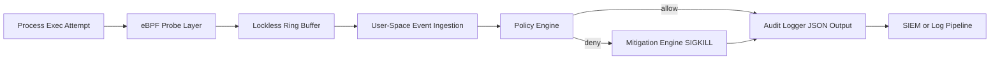

# SysGuardd Architecture

## Overview
SysGuardd is a runtime enforcement daemon for Linux hosts and Kubernetes nodes.
It combines kernel-level event capture with deterministic policy decisions and active mitigation.

Core objective:
- Observe process execution attempts in near real time.
- Decide if execution is allowed using explicit policy.
- Stop unauthorized binaries before they can run.

## System Diagram

## High-Level Data Flow
1. A process launch event (for example `execve`) is intercepted through eBPF.
2. Event metadata is emitted to user space through a lockless ring buffer.
3. A policy engine evaluates the executable and context against active rules.
4. If unauthorized, SysGuardd sends a termination signal (`SIGKILL`).
5. Audit events are exported to downstream systems (JSON or gRPC).

## Main Components

### 1) Kernel Probe Layer
Responsibilities:
- Attach eBPF programs at process execution boundaries.
- Capture minimal, high-value metadata needed for policy checks.

Captured fields (target set):
- PID
- PPID
- Executable path
- Command arguments (truncated by safe limits)
- Timestamp

Design considerations:
- Keep probe logic small and verifiable.
- Avoid expensive operations inside kernel space.

### 2) Transport Layer
Responsibilities:
- Move event records from kernel to user space with low overhead.

Mechanism:
- Memory-mapped lockless ring buffer.

Design considerations:
- Preserve ordering where possible.
- Handle backpressure with bounded drops and metrics.

### 3) Policy Engine
Responsibilities:
- Evaluate process events against enforcement policy.
- Return allow or deny decisions deterministically.

Policy model (initial):
- Explicit deny list for executable paths and patterns.
- Optional parent-process constraints.
- Default action defined per deployment mode.

Performance target:
- O(1)-style lookups for common policy checks.

### 4) Mitigation Engine
Responsibilities:
- Apply enforcement action when a deny decision is returned.

Action model (initial):
- Send `SIGKILL` to blocked process as primary kill path.
- Emit a mandatory audit event for every mitigation action.

### 5) Telemetry and Integrations
Responsibilities:
- Publish normalized events for observability and incident response.

Output targets:
- Local JSON logs
- gRPC event stream for SIEM or cluster control-plane integrations

## Trust Boundaries
- Kernel boundary: untrusted process behavior, trusted verified eBPF program.
- User-space daemon boundary: trusted policy and mitigation logic.
- External integrations boundary: authenticated transport and least-privilege credentials.

## Failure Modes and Safety Defaults
- Policy service unavailable: fail closed for strict mode, fail open for monitor mode.
- Ring buffer overflow: count drops, expose metrics, and alert.
- Mitigation failure: retry once, then emit high-severity alert event.

## Deployment Topologies

### Linux Host Mode
- One SysGuardd daemon per host.
- Local policy file or remote policy endpoint.

### Kubernetes Node Mode
- DaemonSet deployment per node.
- Node-level visibility for workloads running on that node.
- Cluster-level telemetry aggregation.

## Security Notes
- Run with minimum privileges required for eBPF loading and signaling.
- Sign and verify policy bundles where possible.
- Protect telemetry channels with TLS/mTLS.

## Future Enhancements
- Policy-as-code with versioned bundles.
- Allow-list mode for high-trust environments.
- Behavioral heuristics layered on deterministic policies.
- eBPF CO-RE portability optimization.
