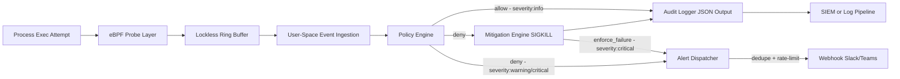

# SysGuardd Architecture

## Overview
SysGuardd is a runtime enforcement daemon for Linux hosts and Kubernetes nodes.
It combines kernel-level event capture with deterministic policy decisions and active mitigation.

Core objective:
- Observe process execution attempts in near real time.
- Decide if execution is allowed using explicit policy.
- Stop unauthorized binaries before they can run.

## System Diagram

## High-Level Data Flow
1. A process launch event (for example `execve`) is intercepted through eBPF.
2. Event metadata is emitted to user space through a lockless ring buffer.
3. A monotonic `event_id` is assigned and `severity` is computed for the event.
4. A policy engine evaluates the executable and context against active rules.
5. If unauthorized and in enforce mode, SysGuardd sends a termination signal (`SIGKILL`).
6. Every event is logged as a structured JSON audit record including `event_id`, `severity`, `node_id`, and `policy_version`.
7. Deny and enforce-failure events are non-blocking queued to the Alert Dispatcher.
8. The Alert Dispatcher applies deduplication and rate limiting before forwarding to a webhook endpoint.

## Main Components

### 1) Kernel Probe Layer
Responsibilities:
- Attach eBPF programs at process execution boundaries.
- Capture minimal, high-value metadata needed for policy checks.

Captured fields (target set):
- PID
- PPID
- Executable path
- Command arguments (truncated by safe limits)
- Timestamp

Design considerations:
- Keep probe logic small and verifiable.
- Avoid expensive operations inside kernel space.

### 2) Transport Layer
Responsibilities:
- Move event records from kernel to user space with low overhead.

Mechanism:
- Memory-mapped lockless ring buffer.

Design considerations:
- Preserve ordering where possible.
- Handle backpressure with bounded drops and metrics.

### 3) Policy Engine
Responsibilities:
- Evaluate process events against enforcement policy.
- Return allow or deny decisions deterministically.

Policy model (initial):
- Explicit deny list for executable paths and patterns.
- Optional parent-process constraints.
- Default action defined per deployment mode.

Performance target:
- O(1)-style lookups for common policy checks.

### 4) Mitigation Engine
Responsibilities:
- Apply enforcement action when a deny decision is returned.

Action model (initial):
- Send `SIGKILL` to blocked process as primary kill path.
- Emit a mandatory audit event for every mitigation action.

### 5) Telemetry and Integrations
Responsibilities:
- Publish normalized events for observability and incident response.

Output targets:
- Local JSON logs (structured, one event per line)
- gRPC event stream for SIEM or cluster control-plane integrations (planned)

Normalized audit event fields:
- `event_id` — monotonic hex counter, unique per daemon run; correlates log lines with alerts
- `severity` — `info` (allow), `warning` (deny in monitor mode), `critical` (deny in enforce mode or mitigation failure)
- `node_id` — host identity; defaults to system hostname, overridable via `--node-id` or Kubernetes Downward API
- `policy_version` — optional tag for tracing which policy version produced the decision

### 6) Alert Dispatcher
Responsibilities:
- Deliver security alert events to external notification endpoints in real time.
- Protect the event loop from any blocking I/O.

Design:
- Runs on a dedicated background worker thread.
- Receives events via a bounded in-process queue (max 128 entries); oldest entry dropped on overflow.
- Applies per-key deduplication (`exe + severity`) within a configurable window to suppress repeated alerts.
- Applies token-bucket rate limiting (configurable per-minute cap) to prevent alert storms.
- Posts Slack/Teams-compatible JSON payloads via plain HTTP POST.
- Delivery failures are logged to stderr; the daemon runtime is never interrupted.
- Instantiated only when `--alert-enabled` is passed; zero overhead when disabled.

## Trust Boundaries
- Kernel boundary: untrusted process behavior, trusted verified eBPF program.
- User-space daemon boundary: trusted policy and mitigation logic.
- External integrations boundary: authenticated transport and least-privilege credentials.

## Failure Modes and Safety Defaults
- Policy service unavailable: fail closed for strict mode, fail open for monitor mode.
- Ring buffer overflow: count drops, expose metrics, and alert.
- Mitigation failure: logged as `action_error`; severity escalated to `critical`; alert dispatched if enabled.
- Webhook delivery failure: logged to stderr; daemon continues without interruption.
- Alert queue full: oldest queued alert dropped silently; event loop never blocked.
- Alert rate limit exceeded: excess alerts dropped; resets after one minute.

## Deployment Topologies

### Linux Host Mode
- One SysGuardd daemon per host.
- Local policy file or remote policy endpoint.

### Kubernetes Node Mode
- DaemonSet deployment per node.
- Node-level visibility for workloads running on that node.
- Cluster-level telemetry aggregation.

## Security Notes
- Run with minimum privileges required for eBPF loading and signaling.
- Sign and verify policy bundles where possible.
- Protect telemetry channels with TLS/mTLS.

## Future Enhancements
- Policy-as-code with versioned bundles.
- Allow-list mode for high-trust environments.
- Behavioral heuristics layered on deterministic policies.
- Monitoring API (`/health`, `/status`, `/events`, `/stats`) with token authentication.
- Read-only web dashboard for live event feed and blocked-executable trends.
- HTTPS webhook support for the Alert Dispatcher.
- gRPC telemetry stream for SIEM integration.
- eBPF CO-RE portability optimization.
